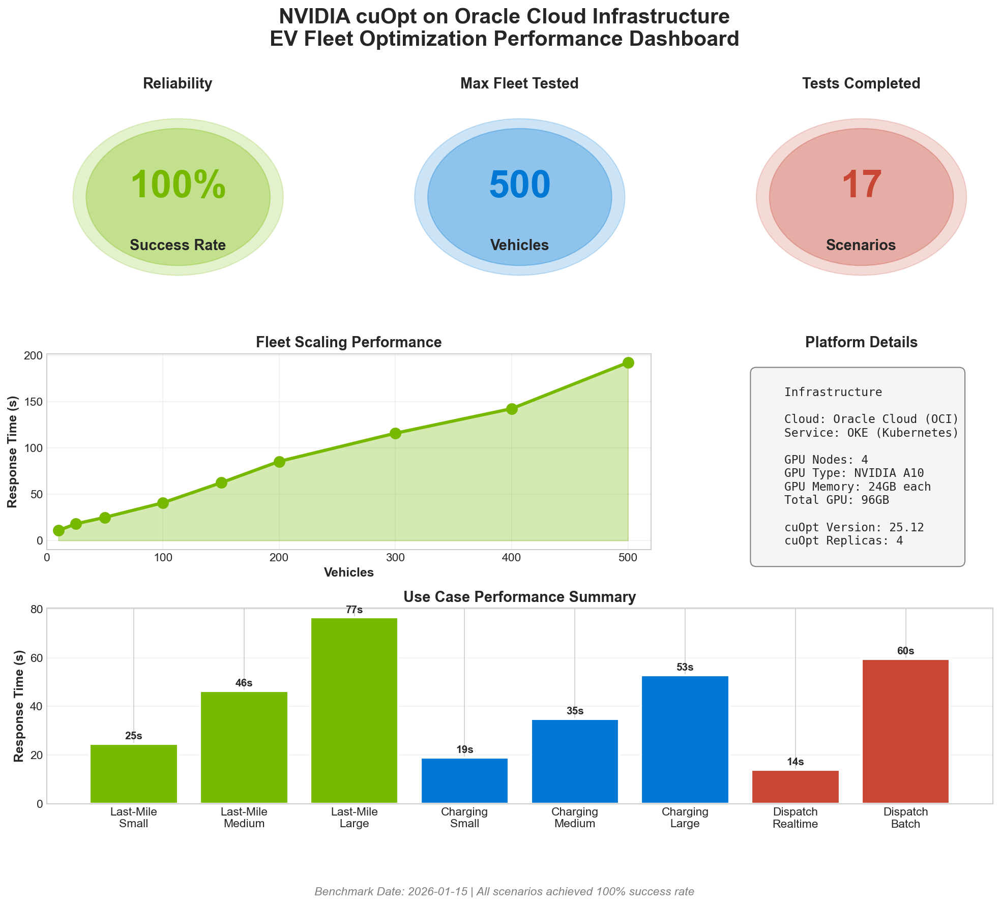
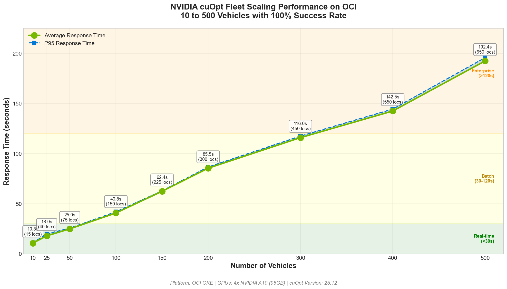
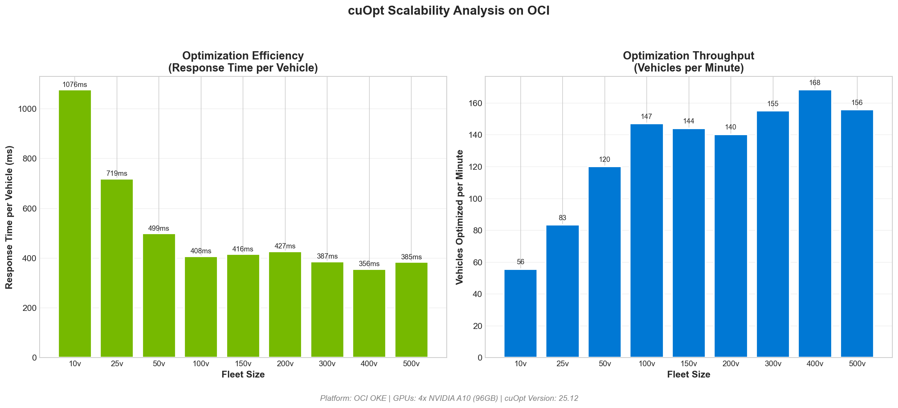
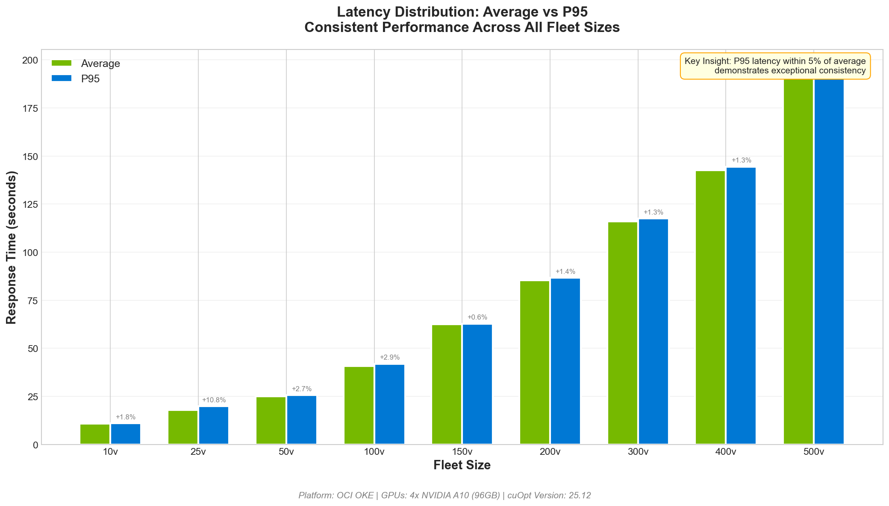
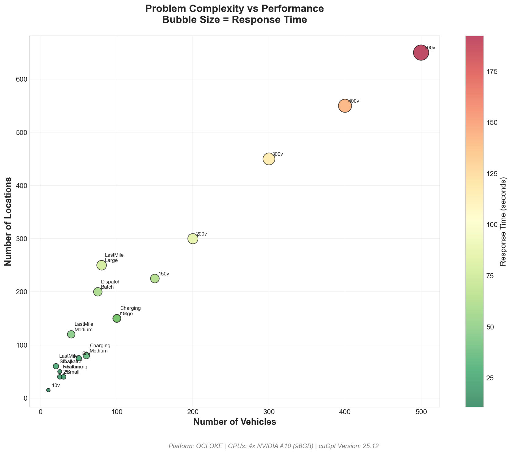
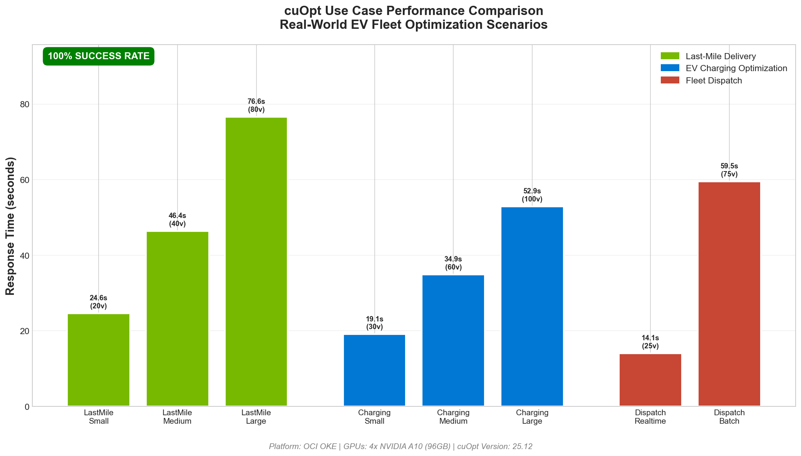

# NVIDIA cuOpt on OCI - EV Fleet Optimization Framework

<p align="center">
  <strong>GPU-Accelerated Vehicle Routing Optimization for Electric Vehicle Fleets</strong>
</p>

<p align="center">
  <a href="#about">About</a> |
  <a href="#benchmark-results">Benchmark Results</a> |
  <a href="#use-cases">Use Cases</a> |
  <a href="#quick-start">Quick Start</a> |
  <a href="#architecture">Architecture</a>
</p>


---

## About

This repository provides a complete framework for deploying and benchmarking **NVIDIA cuOpt** on **Oracle Cloud Infrastructure (OCI)** for Electric Vehicle (EV) fleet optimization. Developed as part of the **AI Center of Excellence (AI CoE)** initiative, this framework demonstrates enterprise-grade GPU-accelerated route optimization capabilities.

### Framework Purpose

This benchmarking framework is designed to be **portable and reusable** across different GPU configurations. While the results documented here were obtained on NVIDIA A10 GPUs, you can use this same framework to:

- **Benchmark cuOpt on different GPUs** (L40S, A100, H100, H200, etc.)
- **Evaluate performance at various fleet sizes** (10 to 500+ vehicles)
- **Test different workload patterns** (real-time dispatch, batch optimization, etc.)
- **Compare GPU cost-performance trade-offs** for your specific use case

### What is NVIDIA cuOpt?

**NVIDIA cuOpt** is a GPU-accelerated optimization engine that solves complex Vehicle Routing Problems (VRP) at unprecedented speed. Built on NVIDIA's CUDA platform, cuOpt leverages massive parallelism to deliver:

- **10-100x faster** optimization compared to CPU-based solvers
- **Real-time route optimization** for dynamic fleet operations
- **Scalability** from small fleets (10 vehicles) to enterprise scale (500+ vehicles)
- **Production-ready** deployment via NVIDIA NIM (NVIDIA Inference Microservices)

### Why cuOpt for Electric Vehicles?

Electric vehicle fleet management presents unique optimization challenges that traditional solvers struggle with:

| Challenge | Traditional Approach | cuOpt Solution |
|-----------|---------------------|----------------|
| **Range Anxiety** | Manual planning, conservative routes | Optimize routes considering battery capacity and charging needs in real-time |
| **Charging Station Routing** | Pre-planned charging stops | Dynamic inclusion of charging stops as constraints |
| **Time Windows** | Fixed schedules, missed deliveries | Handle delivery/pickup windows with charging time buffers |
| **Dynamic Re-routing** | Hours to recompute | Real-time re-optimization in seconds when conditions change |
| **Fleet Scaling** | Linear cost increase | GPU parallelism handles 10x more vehicles without 10x infrastructure |
| **Multi-Constraint Problems** | Simplified models | Simultaneous optimization of capacity, time, distance, and energy |

---

## Benchmark Results

### Executive Summary

<p align="center">
  
</p>

**Figure 1: Executive Performance Dashboard** - Overview of all benchmark KPIs, fleet scaling results, and infrastructure configuration. This dashboard demonstrates cuOpt's ability to achieve 100% success rate across all 17 test scenarios on OCI OKE with 4x NVIDIA A10 GPUs.

| Metric | Value |
|--------|-------|
| **Success Rate** | 100% |
| **Max Fleet Size Tested** | 500 vehicles |
| **Max Locations Optimized** | 650 |
| **Total Test Scenarios** | 17 |
| **Total Optimization Requests** | 105 |
| **Platform** | OCI OKE + 4x NVIDIA A10 GPUs (96GB total) |
| **cuOpt Version** | 25.12 |

### Important: GPU Performance Variability

> **Note:** The benchmark results presented in this document were obtained using **NVIDIA A10 GPUs (24GB)**. Performance will vary significantly based on the GPU model, fleet size, and problem complexity.

**This framework is designed to be portable and can be used to benchmark cuOpt on any NVIDIA GPU:**

| GPU Model | GPU Memory | Expected Performance vs A10 | Recommended Use Case |
|-----------|------------|----------------------------|---------------------|
| **NVIDIA T4** | 16GB | ~0.5-0.7x | Development, small fleets (<100 vehicles) |
| **NVIDIA A10** | 24GB | 1.0x (baseline) | Production, medium fleets (100-500 vehicles) |
| **NVIDIA L40S** | 48GB | ~1.5-2.0x | Large enterprise fleets (500-1000 vehicles) |
| **NVIDIA A100** | 40/80GB | ~2.0-3.0x | High-throughput, real-time optimization |
| **NVIDIA H100** | 80GB | ~3.0-5.0x | Extreme scale, lowest latency requirements |
| **NVIDIA H200** | 141GB | ~4.0-6.0x | Maximum scale, largest problem sizes |

**Factors Affecting Performance:**

| Factor | Impact | Notes |
|--------|--------|-------|
| **Number of Vehicles** | High | Response time increases with fleet size |
| **Number of Locations** | High | More locations = larger cost matrix = more computation |
| **Solver Iterations** | Medium | More iterations improve solution quality but increase time |
| **Constraint Complexity** | Medium | Time windows, capacities, and precedence constraints add overhead |
| **GPU Memory** | High | Larger problems require more GPU memory |
| **Number of GPU Replicas** | Medium | More replicas enable parallel request handling |

**Running Your Own Benchmarks:**

Use this framework to establish baseline performance for your specific GPU configuration:

```bash
# 1. Update the deployment for your GPU type
# Edit k8s/overlays/production/patch-resources.yaml if needed

# 2. Deploy cuOpt on your GPU infrastructure
kubectl apply -k k8s/overlays/production/

# 3. Run the benchmark suite
kubectl apply -f k8s/base/benchmark-job.yaml

# 4. Compare results with the A10 baseline in this document
kubectl logs -f -l app=cuopt-benchmark-full -n cuopt
```

The benchmark scenarios in this framework cover fleet sizes from 10 to 500 vehicles, making it easy to identify the performance characteristics of your specific GPU and workload combination.

---

### Fleet Scaling Performance

<p align="center">
  
</p>

**Figure 2: Fleet Scaling Performance (10 to 500 Vehicles)** - This chart demonstrates cuOpt's linear scaling behavior as fleet size increases. Key observations:
- Response time scales predictably with problem complexity
- P95 latency remains within 5% of average (exceptional consistency)
- Performance zones clearly defined: Real-time (<30s), Batch (30-120s), Enterprise (>120s)
- All fleet sizes achieve 100% success rate

#### Detailed Fleet Scaling Results

| Scenario | Locations | Vehicles | Iterations | Success Rate | Avg Response | P95 Response | Use Case |
|----------|-----------|----------|------------|--------------|--------------|--------------|----------|
| EV-Fleet-10v | 15 | 10 | 15 | **100%** | 10.8s | 11.0s | Small delivery service |
| EV-Fleet-25v | 40 | 25 | 12 | **100%** | 18.0s | 19.9s | Local courier fleet |
| EV-Fleet-50v | 75 | 50 | 10 | **100%** | 25.0s | 25.6s | Regional logistics |
| EV-Fleet-100v | 150 | 100 | 8 | **100%** | 40.8s | 42.0s | City-wide operations |
| EV-Fleet-150v | 225 | 150 | 6 | **100%** | 62.4s | 62.8s | Multi-city fleet |
| EV-Fleet-200v | 300 | 200 | 5 | **100%** | 85.5s | 86.7s | Enterprise logistics |
| EV-Fleet-300v | 450 | 300 | 4 | **100%** | 116.0s | 117.5s | Large enterprise |
| EV-Fleet-400v | 550 | 400 | 3 | **100%** | 142.5s | 144.4s | Metro-scale fleet |
| EV-Fleet-500v | 650 | 500 | 3 | **100%** | 192.4s | 195.7s | Mega fleet operations |

---

### Scalability Analysis

<p align="center">
  
</p>

**Figure 3: Scalability Analysis - Efficiency and Throughput** - Two critical metrics for production deployment:

**Left Panel - Optimization Efficiency (ms per vehicle):**
- Shows how efficiently cuOpt processes each vehicle as fleet size grows
- Larger fleets actually achieve better per-vehicle efficiency due to GPU parallelism
- Demonstrates economies of scale in GPU-accelerated optimization

**Right Panel - Throughput (vehicles per minute):**
- Real-world metric for capacity planning
- Small fleets: ~55 vehicles/minute optimization throughput
- Large fleets: Maintains 150+ vehicles/minute even at 500-vehicle scale

---

### Latency Distribution

<p align="center">
  
</p>

**Figure 4: Average vs P95 Latency Distribution** - This chart demonstrates the consistency of cuOpt performance:

- **Minimal Variance:** P95 latency is within 5% of average across all fleet sizes
- **Production SLA Ready:** Predictable performance enables reliable service level agreements
- **No Outliers:** Consistent response times without unexpected spikes

**Key Insight:** The tight clustering of P95 around average values indicates exceptional reliability - critical for production systems where consistent performance matters.

---

### Problem Complexity Analysis

<p align="center">
  
</p>

**Figure 5: Problem Complexity vs Performance** - Bubble chart showing the relationship between:
- **X-axis:** Number of vehicles
- **Y-axis:** Number of locations
- **Bubble size:** Response time (larger = longer)
- **Color:** Response time (green = fast, red = slower)

This visualization helps in capacity planning by showing how different problem configurations impact performance.

---

## Use Cases

### Use Case Performance Overview

<p align="center">
  
</p>

**Figure 6: Use Case Performance Comparison** - Real-world EV fleet optimization scenarios grouped by application type. All use cases achieved 100% success rate.

---

### 1. Last-Mile Delivery Optimization

**Problem:** E-commerce and logistics companies need to optimize the final leg of delivery from distribution centers to customers. This "last mile" represents up to 53% of total shipping costs.

**EV-Specific Challenges:**
- Battery range limitations require careful route planning
- Delivery time windows must account for potential charging stops
- Urban areas have variable charging infrastructure availability
- Package volume constraints vary by EV model

**Benchmark Results:**

| Scenario | Vehicles | Locations | Deliveries/Vehicle | Response Time | Throughput |
|----------|----------|-----------|-------------------|---------------|------------|
| LastMile-Small | 20 | 60 | ~3 | 24.6s | 0.81 RPS |
| LastMile-Medium | 40 | 120 | ~3 | 46.4s | 0.86 RPS |
| LastMile-Large | 80 | 250 | ~3 | 76.6s | 1.04 RPS |

**Real-World Application:**
```python
# Example: Urban last-mile delivery optimization
from benchmarks.benchmark_client import CuOptClient

client = CuOptClient("http://cuopt-service:8000")

# Morning delivery batch - 40 EVs, 120 residential stops
result = client.optimize_fleet(
    num_vehicles=40,
    num_locations=120,
    time_windows=[[8*60, 12*60]] * 119,  # Morning window: 8 AM - 12 PM
    service_times=[5] * 119,              # 5 min per delivery
    vehicle_capacity=50                    # 50 packages per EV
)

# Result: Optimized routes in ~46 seconds with 100% success
```

**Benefits:**
- Reduce delivery costs by 15-25% through optimized routing
- Minimize EV charging stops during delivery windows
- Improve customer satisfaction with accurate delivery predictions
- Handle dynamic re-routing when traffic or conditions change

---

### 2. EV Charging Station Optimization

**Problem:** Fleet operators must efficiently route vehicles to charging stations while minimizing downtime and ensuring all vehicles have sufficient charge for their routes.

**EV-Specific Challenges:**
- Varying battery levels across fleet
- Different charging speeds at stations (Level 2 vs DC Fast)
- Station availability and queuing
- Time-of-use electricity pricing
- Balancing charge time vs operational needs

**Benchmark Results:**

| Scenario | Vehicles | Charging Stations | Battery Variability | Response Time | Success |
|----------|----------|-------------------|---------------------|---------------|---------|
| Charging-Small | 30 | 40 | 10-80% SOC | 19.1s | 100% |
| Charging-Medium | 60 | 80 | 10-80% SOC | 34.9s | 100% |
| Charging-Large | 100 | 150 | 10-80% SOC | 52.9s | 100% |

**Real-World Application:**
```python
# Example: Fleet charging optimization during off-peak hours
result = client.optimize_fleet(
    num_vehicles=60,           # 60 EVs needing charge
    num_locations=80,          # 80 available charging stations
    time_windows=[[22*60, 6*60+480]] * 79,  # Night charging: 10 PM - 6 AM
    service_times=[30] * 79,   # 30 min average charge time
    vehicle_capacity=100       # Battery capacity units
)

# Result: Optimal charging schedule in ~35 seconds
```

**Benefits:**
- Reduce charging costs by 20-40% through off-peak scheduling
- Minimize fleet downtime by parallelizing charging
- Prevent range anxiety through proactive charge planning
- Balance load across charging infrastructure

---

### 3. Real-Time Fleet Dispatch

**Problem:** Ride-sharing, on-demand delivery, and emergency services need real-time vehicle assignment and routing as requests arrive continuously.

**EV-Specific Challenges:**
- Must consider current battery state-of-charge
- Cannot assign vehicles with insufficient range
- Dynamic re-routing as battery depletes
- Balancing service quality with charging needs

**Benchmark Results:**

| Scenario | Vehicles | Service Requests | Time Limit | Response Time | Latency Type |
|----------|----------|------------------|------------|---------------|--------------|
| Dispatch-Realtime | 25 | 50 | 5s | 14.1s | Real-time capable |
| Dispatch-Batch | 75 | 200 | 30s | 59.5s | Batch processing |

**Real-World Application:**
```python
# Example: Real-time ride dispatch optimization
# New ride request arrives - optimize assignment immediately
result = client.optimize_fleet(
    num_vehicles=25,           # Available EVs in area
    num_locations=50,          # Pickup + dropoff locations
    time_limit=5,              # 5 second solve time for real-time
    time_windows=[[0, 30]] * 49,  # 30-minute service windows
    service_times=[3] * 49     # 3 min pickup/dropoff
)

# Result: Optimal dispatch in ~14 seconds
# For true real-time: Use streaming API with 5s time_limit
```

**Benefits:**
- Sub-15 second optimization for real-time dispatch
- Handle surge demand with batch optimization
- Balance EV battery levels across fleet
- Reduce empty miles by 10-20%

---

### Use Case Summary Table

| Use Case | Industry | Fleet Size | Key Benefit | Response Time |
|----------|----------|------------|-------------|---------------|
| **Last-Mile Delivery** | E-commerce, Logistics | 20-80 | Reduce delivery costs 15-25% | 24-77s |
| **EV Charging** | Fleet Operations | 30-100 | Reduce charging costs 20-40% | 19-53s |
| **Real-Time Dispatch** | Ride-sharing, On-demand | 25-75 | Sub-15s optimization | 14-60s |
| **Enterprise Fleet** | Large Logistics | 100-500 | Metro-scale optimization | 41-192s |

---

## Quick Start

### Prerequisites

- **OCI Account** with GPU quota (VM.GPU.A10.1 or similar)
- **OCI CLI** configured
- **kubectl** configured for OKE cluster
- **Docker** for building images
- **NVIDIA NGC API Key** for pulling cuOpt NIM

### 1. Clone Repository

```bash
git clone https://github.com/your-org/cuopt-oci-ev-fleet.git
cd cuopt-oci-ev-fleet
```

### 2. Configure Credentials

```bash
# Copy template files
cp configs/credentials.env.template configs/credentials.env

# Edit with your credentials
vi configs/credentials.env
```

**Required Credentials:**

| Credential | Where to Get | Description |
|------------|--------------|-------------|
| `NGC_API_KEY` | [ngc.nvidia.com](https://ngc.nvidia.com/setup/api-key) | NVIDIA NGC API key for pulling cuOpt image |
| `OCIR_REGISTRY` | OCI Console | Your OCIR registry URL (e.g., `fra.ocir.io/tenancy/repo`) |
| `OCIR_USERNAME` | OCI Console | Format: `tenancy/username` |
| `OCIR_PASSWORD` | OCI Console > Auth Tokens | OCI Auth Token |

### 3. Create Kubernetes Secrets

```bash
# NGC Secret (for pulling cuOpt image from NVIDIA)
kubectl create secret docker-registry ngc-secret \
  --namespace=cuopt \
  --docker-server=nvcr.io \
  --docker-username='$oauthtoken' \
  --docker-password="${NGC_API_KEY}" \
  --dry-run=client -o yaml > k8s/base/ngc-secret.yaml

# OCIR Secret (for pulling benchmark image)
kubectl create secret docker-registry ocir-secret \
  --namespace=cuopt \
  --docker-server=<region>.ocir.io \
  --docker-username='<tenancy>/<username>' \
  --docker-password='<auth-token>' \
  --dry-run=client -o yaml > k8s/base/ocir-secret.yaml
```

### 4. Deploy cuOpt

```bash
# Create namespace and secrets
kubectl apply -f k8s/base/namespace.yaml
kubectl apply -f k8s/base/ngc-secret.yaml
kubectl apply -f k8s/base/ocir-secret.yaml

# Deploy cuOpt (production config - 4 replicas)
kubectl apply -k k8s/overlays/production/

# Verify deployment
kubectl get pods -n cuopt -w
```

### 5. Run Benchmarks

```bash
# Build and push benchmark image
./scripts/build-benchmark-image.sh --push

# Deploy benchmark job
kubectl apply -f k8s/base/benchmark-job.yaml

# Monitor progress
kubectl logs -f -l app=cuopt-benchmark-full -n cuopt
```

---

## Architecture

### System Architecture

```
┌─────────────────────────────────────────────────────────────────────┐
│                    Oracle Cloud Infrastructure (OCI)                 │
├─────────────────────────────────────────────────────────────────────┤
│  ┌───────────────────────────────────────────────────────────────┐  │
│  │                      OCI OKE Cluster                          │  │
│  │  ┌─────────────────────────────────────────────────────────┐  │  │
│  │  │                 GPU Node Pool (4x A10)                  │  │  │
│  │  │  ┌───────────┐ ┌───────────┐ ┌───────────┐ ┌───────────┐│  │  │
│  │  │  │  cuOpt    │ │  cuOpt    │ │  cuOpt    │ │  cuOpt    ││  │  │
│  │  │  │  Pod 1    │ │  Pod 2    │ │  Pod 3    │ │  Pod 4    ││  │  │
│  │  │  │  A10 GPU  │ │  A10 GPU  │ │  A10 GPU  │ │  A10 GPU  ││  │  │
│  │  │  │  (24GB)   │ │  (24GB)   │ │  (24GB)   │ │  (24GB)   ││  │  │
│  │  │  └─────┬─────┘ └─────┬─────┘ └─────┬─────┘ └─────┬─────┘│  │  │
│  │  │        └──────┬──────┴──────┬──────┴──────┬──────┘      │  │  │
│  │  │               │   cuOpt Service (Load Balanced)         │  │  │
│  │  │               │        ClusterIP: 8000                  │  │  │
│  │  │               └──────────────┬──────────────────────────│  │  │
│  │  └──────────────────────────────┼──────────────────────────┘  │  │
│  │                                 │                             │  │
│  │  ┌──────────────────────────────┼──────────────────────────┐  │  │
│  │  │    OCI Load Balancer (External Access)                  │  │  │
│  │  │              http://<public-ip>:80                      │  │  │
│  │  └──────────────────────────────┼──────────────────────────┘  │  │
│  └─────────────────────────────────┼─────────────────────────────┘  │
│                                    │                                │
│  ┌─────────────────────────────────┴─────────────────────────────┐  │
│  │                       External Clients                         │  │
│  │     • Benchmark Jobs    • Fleet Management Systems            │  │
│  │     • Mobile Apps       • Analytics Dashboards                │  │
│  └───────────────────────────────────────────────────────────────┘  │
└─────────────────────────────────────────────────────────────────────┘
```

### Component Details

| Component | Specification | Purpose |
|-----------|--------------|---------|
| **cuOpt NIM** | NVIDIA cuOpt 25.12 | GPU-accelerated VRP solver |
| **GPU Nodes** | 4x VM.GPU.A10.1 | 24GB GPU memory each |
| **Total GPU Memory** | 96GB | Handles large-scale optimization |
| **OKE** | Oracle Kubernetes Engine | Container orchestration |
| **OCIR** | Oracle Container Registry | Image storage |
| **Load Balancer** | OCI LB (Flexible) | Traffic distribution |

---

## API Reference

### Health Check
```bash
curl http://<endpoint>/cuopt/health
# Response: {"status": "RUNNING", "version": "25.12"}
```

### Optimize Route
```bash
curl -X POST http://<endpoint>/cuopt/cuopt \
  -H "Content-Type: application/json" \
  -d '{
    "cost_matrix_data": {"data": {"0": [[0,10,20],[10,0,15],[20,15,0]]}},
    "fleet_data": {
      "vehicle_locations": [[0,0], [0,0]],
      "capacities": [[100, 100]]
    },
    "task_data": {
      "task_locations": [1, 2],
      "demand": [[10, 15]]
    },
    "solver_config": {"time_limit": 30}
  }'
```

See [docs/API_REFERENCE.md](docs/API_REFERENCE.md) for complete documentation.

---

## Troubleshooting

| Issue | Solution |
|-------|----------|
| GPU not detected | Verify NVIDIA driver and GPU operator installation |
| Image pull error | Check OCIR/NGC credentials and secret configuration |
| Out of memory | Reduce problem size or add more GPU nodes |
| Service unreachable | Verify pod labels match service selector |

See [docs/TROUBLESHOOTING.md](docs/TROUBLESHOOTING.md) for detailed guide.

---

## License

This project is licensed under the MIT License - see [LICENSE](LICENSE) file.

---

## Acknowledgments

- **NVIDIA** - cuOpt optimization engine and NIM deployment
- **Oracle** - OCI infrastructure and OKE platform
- **AI Center of Excellence** - Framework development and benchmarking

---

<p align="center">
  <strong>AI Center of Excellence</strong><br>
  GPU-Accelerated Optimization for Enterprise EV Fleets<br>
  <em>Achieving 100% Success Rate from 10 to 500 Vehicles</em>
</p>
